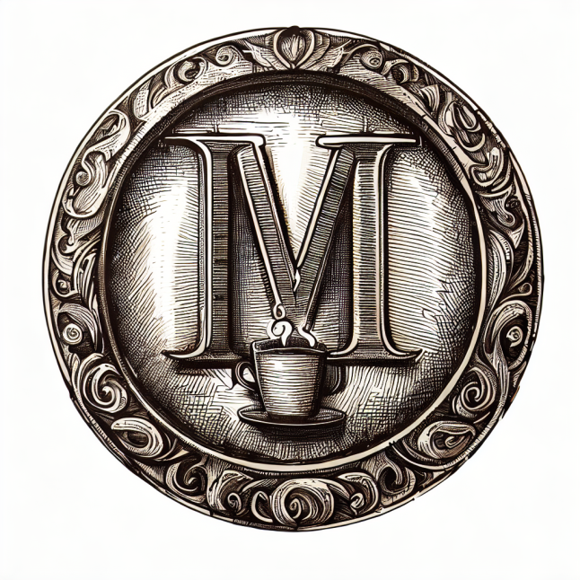

Minimal .NET Modular Monolith implementation in the context of a cafe.

Heavily inspired on the [NCafe](https://github.com/fredimachado/NCafe) project by [Fredi Machado](https://github.com/fredimachado).

### Tech stack:

- **C# 12/.NET 8**
- **ASP.NET Core**
- **EFCore**
- **FasEndpoints**
- **MediatR**

### Warning

This code should be treated as sample code. It's a sandbox for practicing modular monoliths ideas,
CQRS, MediatR, EFCore, FastEndpoints etc.
